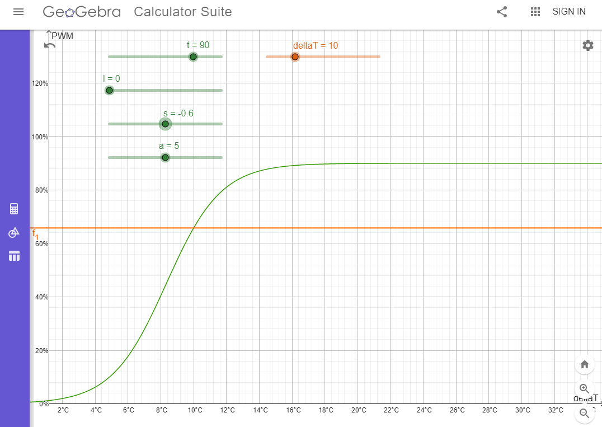
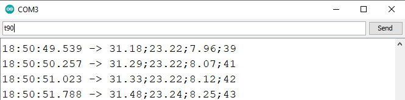

# dt-fancontroll

What you have here is a fan-control utility which runs on an Arduino (Uno R3).
Different from other such tools it will set the PWM duty cycle for your connected fans based on the temperature delta of your water and the ambient temperature.

## What you need
- Arduino with SPI possibilities and PWM Pins
- 2 Temperature Sensors 
In this version I work with NTC Thermistors which each create a voltage divider with an additional 10k resistor.
- Time :-p

## How it's made
Easy to write in words. More of a challenge to actually get it done
1. Read the temperature of the ambient air and the cooling water
2. Get the temperature difference (deltaT)
3. Set a PWM value based on deltaT with the help of the [sigmoid function](https://en.wikipedia.org/wiki/Sigmoid_function)  $y=\dfrac{1}{1+e^{-x}}$

## Example on geogebra
In this folder you  also find a "geogebra-export.ggb" file. You can open the [geogebra calculator](https://www.geogebra.org/calculator) and then load the file by dragging it into the browser window.
Feel free to play with the parameters and create a curve/slope you like for your application.

## Running the application
All parameters can be changed on the fly by sending codes and corresponding data over your USB serial connection

Top row: parameter t to be set by sending over Serial
Displayed log from left to right. waterTemp;ambientTemp;deltaT;PWM

- **r(value)** - sets the variable readCount - has impact on how often data is written back to serial
- **t(value)** - sets the variable s_max - maximum PWM duty cycle which can be achieved
- **l(value)** - sets the variable s_min - minimum PWM duty cycle which can be achieved 
- **s(value)** - sets the variable s_slope - defines how steep the slope is
- **a(value)** - sets the variable s_attack - shifts the whole slope left and right
- **f(value)** - sets the variable STATIC_PWM - forces the duty cycle to a fixed value (set to 0 for dynamic PWM)
 
 For a better understanding please load the geogebra file provided and use the sliders to see what value changes what part of the function.
